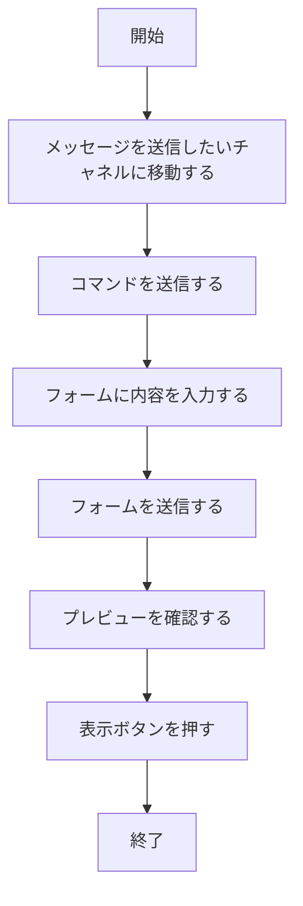
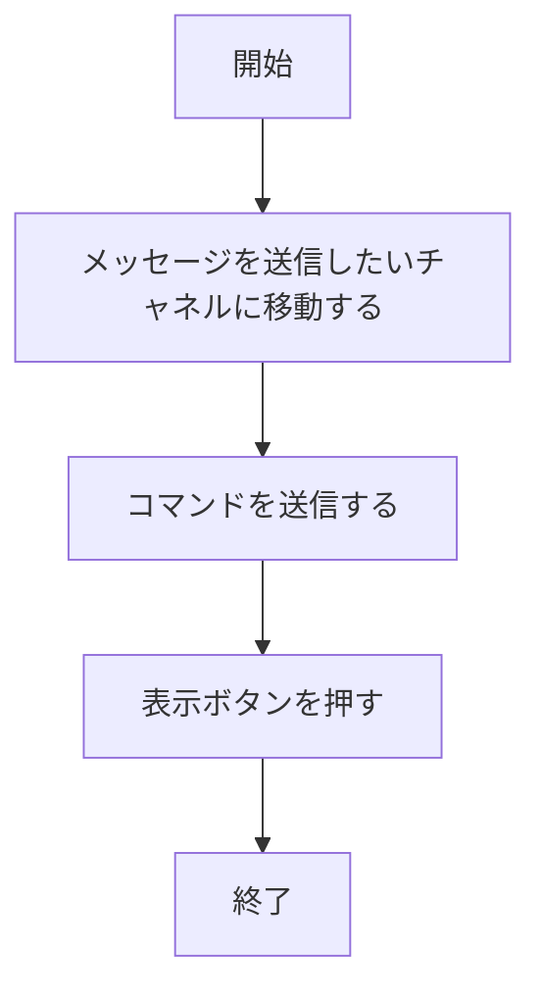
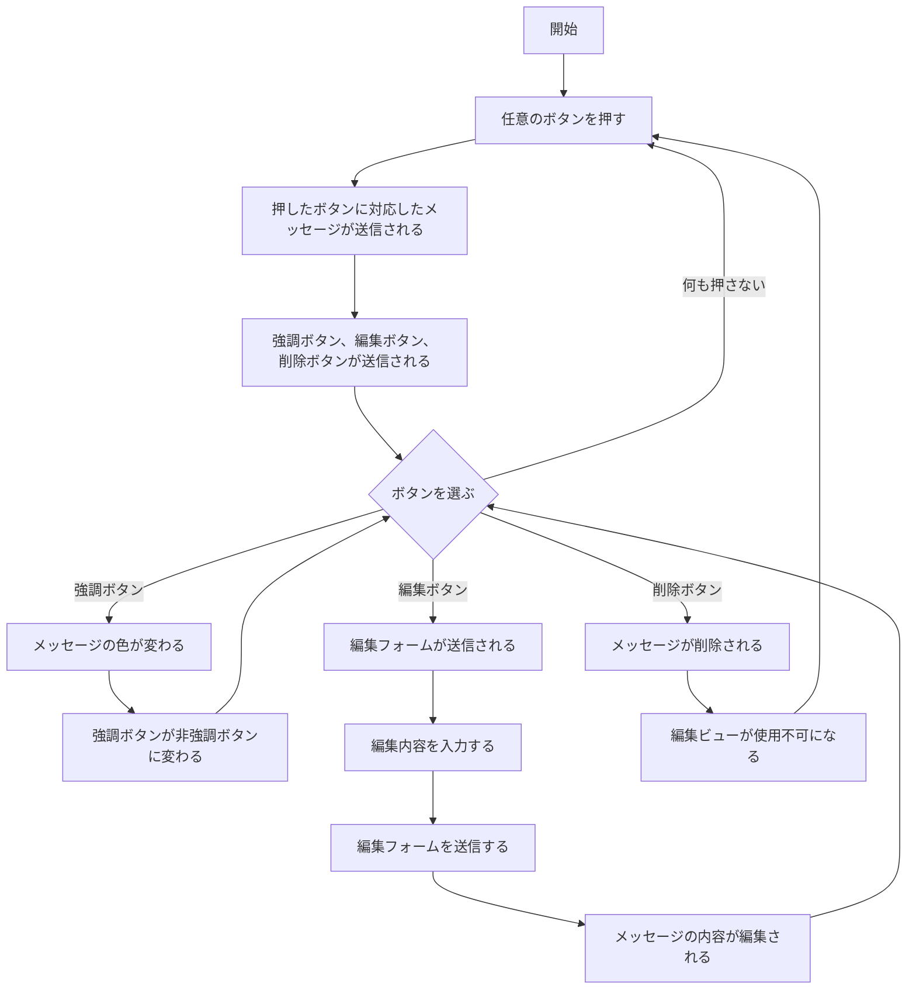

# `/ch`グループ

`/ch`から始まるスラッシュコマンドは、サーバー内のチャネルで使用するためのコマンドです。使用したいサーバー内チャネルで使用する必要があります。

### `/ch normal`
サーバー内の任意のチャネルに**通常**の埋め込みテキストを送信するコマンドです。
:::info
**埋め込みテキスト**とは、Discord内でBotだけが送信できる特殊なメッセージです。メッセージの内容が多く文章量が多い場合に使用すると、通常のメッセージよりも見やすくなります。
:::

---

### `/ch alert`
サーバー内の任意のチャネルに**緊急**の埋め込みテキストを送信するコマンドです。
:::tip
このコマンドのフローチャートは、先程のコマンドと**全く同じ**です。先程と異なるのは、埋め込みテキストの色によります。`/ch normal`では、埋め込みテキストは**水色**になるのに対し、`/ch alert`では**赤色**となります。この違いを効果的に使うことで、どの程度重要な内容なのか伝わりやすくなります。
:::

---

### `/ch key`
サーバー内の任意のチャネルで**鍵開閉フロー**を開始するためのコマンドです。
:::info
このコマンドは部室鍵のチャネルで使うことを目的に作ったので、その他のチャネルでは使う機会は無いかもしれません。
:::
#### コマンド開始のフロー

#### 鍵開閉フロー

